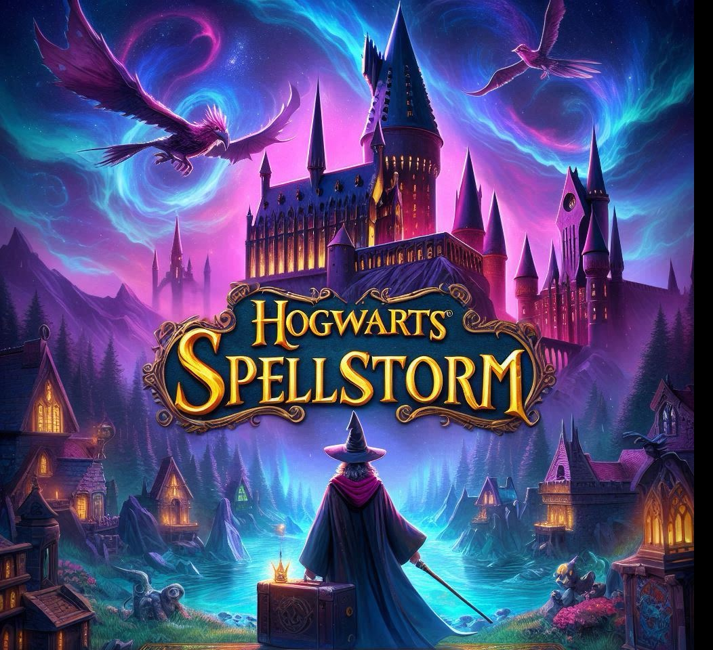

# Hogwarts Spellstorm VR

**Hogwarts Spellstorm** is an immersive VR game where you defend Hogwarts from iconic enemies inspired by the Harry Potter universe. As a student wizard, you must protect the castle from dark forces—like dementors and other magical threats—using your wand, your voice, and your skill. Cast spells by combining spoken incantations and magical gestures, and experience cinematic spell effects, dynamic health systems, and stunning magical visuals as you fight to keep Hogwarts safe.

## Key Features

- **Defend Hogwarts**: Face off against classic Harry Potter enemies in a magical VR setting.
- **Voice + Gesture Spell Casting**: Cast spells using both your voice (powered by Wit.AI) and wand movements (recognized by a custom-trained Sentis model).
- **AI-Powered Recognition**:
  - **Wit.AI**: Understands and processes your spoken spell commands.
  - **Unity Sentis**: Detects and interprets your wand gestures in real time.
- **Magical Visual Effects**:
  - Professional shader-based dissolving effects for enemies.
  - Dynamic health bars and particle effects for immersive feedback.
- **VR Experience**: Built for Oculus and compatible VR platforms, leveraging Unity's XR Interaction Toolkit and Universal Render Pipeline for stunning visuals.

## Controls

- **Voice Commands**: Say spell names (e.g., "Stupefy")
- **Wand Gestures**: Perform spell-specific movements
- **Trigger**: Cast basic fireball spell
- **Special Spells**: Combine voice commands with gestures

## Technical Stack

- **Unity VR** with Oculus integration
- **Wit.AI** for natural language processing
- **Unity Sentis** for real-time gesture recognition
- **ShaderGraph** for magical visual effects
- **Universal Render Pipeline** for enhanced visuals

---